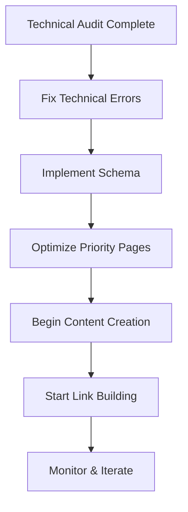

# Prompt 12: Implementation Task Breakdown & Page-Level Action Mapping

## Purpose
Transform the strategic recommendations into granular, actionable tasks with page-level specifications, dependencies, time estimates, and responsible parties. This is the "build manual" that tells the team exactly what to do, in what order, and how long it will take.

## Inputs Required
- Complete strategy document (Prompt 8)
- Keyword strategy (Prompt 9)
- Copy examples (Prompt 10)
- 30/60/90-day roadmap (Prompt 8)
- Priority recommendations (Prompt 8)
- Business constraints (Intake Section 5)
- Available resources (Intake Section 5)

## Output Structure

### 1. Page-Level Action Mapping

For each priority page (15-25 pages), provide specific implementation tasks:

#### Format:
```markdown
## Page: [Page Name]
**URL**: /[slug]
**Page Type**: Homepage / Service Page / Location Page / Blog Post / About
**Current Status**: Exists / Needs Creation
**Priority**: 1-5 (1 = highest)
**Estimated Time**: [X hours]
**Dependencies**: [Must complete X before starting this]

### Onpage SEO Actions
1. **Title Tag**
   - Current: [If exists]
   - New: "[Exact title from Prompt 10]"
   - Character count: [50-60]
   - Time: 5 minutes

2. **Meta Description**
   - Current: [If exists]
   - New: "[Exact meta description from Prompt 10]"
   - Character count: [150-160]
   - Time: 5 minutes

3. **H1 Heading**
   - Current: [If exists]
   - New: "[Exact H1]"
   - Include primary keyword: "[keyword]"
   - Time: 5 minutes

4. **H2-H6 Structure**
   - H2: "[Heading 1]"
   - H2: "[Heading 2]"
   - H2: "[Heading 3]"
   - H3: "[Subheading 1.1]"
   - H3: "[Subheading 1.2]"
   - [Continue for all headings]
   - Time: 15 minutes

5. **Content Sections**
   - Section 1: [Name] (200-250 words)
     - Key points: [Bullet list]
     - Keywords to include: [List]
   - Section 2: [Name] (250-300 words)
     - Key points: [Bullet list]
   - [Continue for all sections]
   - Total word count target: [1500-2500]
   - Time: 3-4 hours

6. **FAQ Section**
   - Add FAQ schema with [X] questions (from Prompt 10)
   - Questions:
     1. "[FAQ 1]"
     2. "[FAQ 2]"
     3. "[FAQ 3]"
     [List all]
   - Time: 1 hour

7. **Imagery**
   - Hero image: [Specifications - size, subject, alt text]
   - Supporting images: [X images needed]
   - Alt text for each: "[Descriptive alt text with keyword]"
   - Time: 1-2 hours

8. **Internal Links**
   - Link to:
     1. [Page 1] with anchor text "[exact anchor]"
     2. [Page 2] with anchor text "[exact anchor]"
     3. [Page 3] with anchor text "[exact anchor]"
   - Receive links from:
     1. [Page A] with anchor text "[exact anchor]"
     2. [Page B] with anchor text "[exact anchor]"
   - Time: 30 minutes

9. **Call to Action**
   - Primary CTA: "[Exact copy from Prompt 10]"
   - Secondary CTA: "[Exact copy]"
   - CTA placement: [Specify locations]
   - Time: 15 minutes

10. **Schema Markup**
    - Schema type: [LocalBusiness / Service / FAQPage / Product]
    - Required properties:
      - name: "[Business Name]"
      - address: "[Full address]"
      - telephone: "[Phone]"
      [List all required properties]
    - JSON-LD code: [Provide ready-to-implement code]
    - Where to place: [In <head> or after closing </body>]
    - Time: 30 minutes

### Technical SEO Actions
11. **URL Structure**
    - Current URL: [If exists]
    - Optimal URL: /[slug]
    - 301 redirect needed: [Yes/No]
    - Time: 10 minutes (if redirect needed: +30 minutes)

12. **Page Speed**
    - Compress images (target: <100KB each)
    - Lazy load images below fold
    - Minify CSS/JS
    - Estimated improvement: [X seconds faster]
    - Time: 1-2 hours

13. **Mobile Optimization**
    - Responsive design check
    - Touch targets >48px
    - Text readable without zoom
    - Time: 1 hour

14. **Core Web Vitals Targets**
    - LCP: <2.5s
    - FID: <100ms
    - CLS: <0.1
    - Time: 2-3 hours (if fixes needed)

### Content Actions
15. **Primary Keyword Integration**
    - Primary: "[keyword]" (from Prompt 9)
    - Target density: 0.5-1.5%
    - Placement: Title, H1, first paragraph, 1-2 H2s, conclusion
    - Time: Included in content writing

16. **Secondary Keywords**
    - "[Secondary 1]"
    - "[Secondary 2]"
    - "[Secondary 3]"
    - Include naturally in body content
    - Time: Included in content writing

17. **Customer Language**
    - Use verbatim phrases from Reddit (Prompt 7):
      - "[Phrase 1]"
      - "[Phrase 2]"
      - "[Phrase 3]"
    - Time: Included in content writing

### Offpage SEO Preparation
18. **Link Targets**
    - This page should be linked from these external sources:
      1. [Publication/Website 1] - [Topic angle]
      2. [Publication/Website 2] - [Topic angle]
      3. [Publication/Website 3] - [Topic angle]
    - Time: N/A (handled in link building tasks)

19. **Social Sharing**
    - Create social posts for this page (from Prompt 10)
    - LinkedIn: "[Post copy]"
    - Twitter: "[Tweet copy]"
    - Time: 30 minutes

### Total Page Time Estimate
**Total hours for this page**: [Sum of all time estimates]
**Responsible party**: [Content writer / Developer / SEO specialist]
**Due date** (from 30/60/90 roadmap): [Specific date]
```

---

### 2. Master Task List (All Pages)

Export as spreadsheet with columns:
- **Task ID**: Unique identifier
- **Task Name**: Specific action
- **Page/Location**: Where this task applies
- **Category**: Onpage / Technical / Content / Offpage / Schema / UX
- **Priority**: 1-5
- **Impact**: High / Medium / Low
- **Effort**: Hours estimate
- **Impact/Effort Score**: Calculated (High impact + Low effort = Quick Win)
- **Dependencies**: Task IDs that must complete first
- **Responsible**: Content / Dev / SEO / Designer
- **Due Date**: From 30/60/90 roadmap
- **Status**: Not Started / In Progress / Complete
- **Notes**: Additional context

#### Example Rows:
| Task ID | Task Name | Page | Category | Priority | Impact | Effort | Score | Dependencies | Responsible | Due Date |
|---------|-----------|------|----------|----------|--------|--------|-------|--------------|-------------|----------|
| 001 | Rewrite homepage title tag | Homepage | Onpage | 1 | High | 0.1h | Quick Win | None | SEO | Day 3 |
| 002 | Add FAQ schema to /services/plumbing | Service page | Schema | 1 | High | 0.5h | Quick Win | 015 | Dev | Day 7 |
| 003 | Create blog post: "7 Signs You Need Emergency Plumbing" | New blog post | Content | 2 | High | 4h | Strategic | 001, 002 | Content | Day 15 |

---

### 3. Technical SEO Implementation Tasks

Separate from page-level tasks, list site-wide technical improvements:

#### Format:
```markdown
## Technical SEO Task: [Task Name]
**Category**: Site Speed / Indexing / Crawlability / Security / Mobile / Core Web Vitals
**Priority**: 1-5
**Impact**: High / Medium / Low
**Effort**: [X hours]
**Dependencies**: [List]

### Objective
[What this achieves and why it matters]

### Current State
[What's wrong or missing now]

### Implementation Steps
1. [Step 1 with specific instructions]
2. [Step 2]
3. [Step 3]
[Continue for all steps]

### Success Criteria
- [ ] [How to verify this is complete]
- [ ] [Measurable outcome]

### Tools/Resources Needed
- [Tool 1]
- [Access to X]
- [Skill/knowledge required]

### Testing
1. [How to test before going live]
2. [How to verify in production]

### Time Estimate
**Total hours**: [X hours]
**Responsible**: [Developer / SEO specialist / Sysadmin]
**Due Date**: [From roadmap]
```

#### Example Technical Tasks:
1. **Implement XML sitemap with priority signals**
2. **Fix crawl errors (404s, 500s, redirect chains)**
3. **Enable HTTPS site-wide (if not already)**
4. **Set up Google Search Console + GA4 properly**
5. **Implement canonical tags site-wide**
6. **Fix duplicate content issues**
7. **Optimize robots.txt**
8. **Implement image compression pipeline**
9. **Set up CDN for static assets**
10. **Fix mobile usability errors**

---

### 4. Content Production Tasks

Separate list for all content creation (blog posts, guides, resources):

#### Format:
```markdown
## Content Task: [Content Title]
**URL**: /blog/[slug]
**Content Type**: Blog post / Guide / Case study / Comparison / Listicle
**Word Count**: [1500-3000]
**Priority**: 1-5
**Primary Keyword**: "[keyword]" (Search volume: [X])
**Secondary Keywords**: "[keyword 1]", "[keyword 2]", "[keyword 3]"

### Content Brief
- **Target Audience**: [From JTBD Prompt 9]
- **Search Intent**: Informational / Commercial / Transactional
- **Customer Job**: [Which job does this content serve?]
- **Journey Stage**: Awareness / Consideration / Decision
- **4-Layer Model**: Layer 1 / 2 / 3 / 4

### Outline
1. **Introduction** (150-200 words)
   - Hook: [Specific hook]
   - Include primary keyword in first 100 words

2. **Section 1**: [H2 heading]
   - [Key points to cover]
   - [Keywords to include]

3. **Section 2**: [H2 heading]
   - [Key points]

[Continue for all sections]

8. **Conclusion** (100-150 words)
   - Summary
   - CTA: "[Exact CTA copy]"

### FAQs (from Prompt 10)
1. "[Question 1]" → "[Answer]"
2. "[Question 2]" → "[Answer]"
[List 3-7 FAQs]

### Internal Links
- Link to:
  1. [Page 1] with anchor "[exact anchor]"
  2. [Page 2] with anchor "[exact anchor]"

### External Links (Authority Sources)
- [Industry report / study]
- [Government data]
- [Academic research]

### Images Needed
1. Hero image: [Specifications]
2. Supporting images: [X images, specifications]
3. Infographic (optional): [Subject]

### Meta Data
- **Title**: "[Exact title from Prompt 10]"
- **Meta Description**: "[Exact meta description from Prompt 10]"
- **Focus Keyword**: "[Primary keyword]"

### Schema
- **Type**: Article / BlogPosting / FAQPage
- **Implementation**: [Provide JSON-LD]

### Time Estimate
- Research: [1 hour]
- Writing: [4-6 hours]
- Editing: [1 hour]
- Images/formatting: [1 hour]
- **Total**: [7-9 hours]

### Responsible
**Writer**: [Name/role]
**Editor**: [Name/role]
**Publisher**: [Name/role]

### Due Date
[From 30/60/90 roadmap]
```

---

### 5. Link Building Tasks

Offpage SEO action list:

#### Format:
```markdown
## Link Building Campaign: [Campaign Name]
**Tactic**: Digital PR / Resource Page / Broken Link Building / HARO / Guest Post / Partnership
**Target**: [X links in Y timeframe]
**Priority**: 1-5

### Target Publications/Websites
1. **[Website Name]**
   - URL: [URL]
   - DA/DR: [Score]
   - Relevance: High / Medium / Low
   - Contact: [Email/Name if known]
   - Angle: [Pitch angle]
   - Target page: [Which page on our site to link to]

[List 10-20 targets per campaign]

### Outreach Template
**Subject**: [Email subject line]

**Body**:
```
[Personalized email template with merge fields]
```

### Success Metrics
- Links acquired: [Target number]
- DR of linking domains: [Average target]
- Referral traffic: [Expected]

### Time Estimate
- Research targets: [X hours]
- Outreach: [Y hours]
- Follow-up: [Z hours]
- **Total**: [X hours]

### Responsible
**Link Builder**: [Name/role]
**Due Date**: [From roadmap]
```

#### Example Link Building Tasks:
1. **HARO responses** (20 responses/month)
2. **Digital PR campaign**: [Topic angle]
3. **Resource page outreach**: [Niche directory]
4. **Broken link building**: [Target sites]
5. **Guest post placements**: [Publications list]

---

### 6. Local SEO Tasks (If Applicable)

For local businesses:

#### Google Business Profile Optimization
1. **Update business information**
   - Name: [Exact match NAP]
   - Address: [Full address]
   - Phone: [Primary phone]
   - Website: [URL]
   - Hours: [Complete hours]
   - Categories: [Primary], [Secondary 1], [Secondary 2]
   - Time: 1 hour

2. **Add photos**
   - Exterior: [X photos]
   - Interior: [X photos]
   - Products/services: [X photos]
   - Team: [X photos]
   - At work: [X photos]
   - Target: 50+ photos
   - Time: 2-3 hours

3. **Posts (weekly)**
   - Offer posts: [Topic]
   - Update posts: [Topic]
   - Event posts: [Topic]
   - Time: 1 hour/week

4. **Q&A**
   - Seed 15-20 questions from FAQ list (Prompt 10)
   - Monitor and respond to new questions
   - Time: 2 hours initial, 30 min/week ongoing

5. **Reviews strategy**
   - Request reviews from: [Customer touchpoints]
   - Respond to all reviews within 24 hours
   - Target: [X reviews/month]
   - Time: 1 hour/week

#### Map Pack Optimization
- NAP consistency audit across all directories
- Local citations: [List 20-30 directories]
- LocalBusiness schema on all location pages
- Time: 5-10 hours

---

### 7. 30/60/90-Day Task Breakdown

Map all tasks to roadmap phases:

#### Days 1-30 (Foundation)
**Focus**: Quick wins, technical fixes, high-priority pages

| Task ID | Task | Hours | Owner | Due |
|---------|------|-------|-------|-----|
| 001 | Homepage title/meta rewrite | 0.5 | SEO | Day 3 |
| 002 | Fix technical errors (404s, redirects) | 3 | Dev | Day 5 |
| 003 | Implement XML sitemap | 2 | Dev | Day 7 |
| 004 | Add FAQ schema to 5 priority pages | 3 | Dev | Day 10 |
| 005 | Rewrite 10 priority service page titles/metas | 2 | SEO | Day 14 |
[Continue for all Month 1 tasks]

**Total Month 1 Hours**: [Sum]
**Expected Outcomes**:
- [X] technical issues resolved
- [X] pages optimized
- [X] schema implementations
- Foundation ready for content creation

#### Days 31-60 (High-Intent)
**Focus**: Content creation, link building start, conversion optimization

[Same task table format]

**Total Month 2 Hours**: [Sum]
**Expected Outcomes**:
- [X] blog posts published
- [X] links acquired
- [X] conversions improved

#### Days 61-90 (Authority)
**Focus**: Thought leadership, AI visibility, authority building

[Same task table format]

**Total Month 3 Hours**: [Sum]
**Expected Outcomes**:
- [X] authority pieces published
- [X] AI citations achieved
- [X] visibility improvements

---

### 8. Resource Allocation

Based on total hours and available resources (from intake):

**Total Hours Required**:
- Onpage SEO: [X hours]
- Technical SEO: [X hours]
- Content creation: [X hours]
- Link building: [X hours]
- Local SEO: [X hours]
- **Grand Total**: [X hours]

**Available Resources** (from Intake Section 5):
- Internal team: [Hours/week available]
- Budget: [£X for contractors/tools]
- Technical support: [Dev hours/week]

**Resource Gap Analysis**:
- Required hours/week: [Total/13 weeks]
- Available hours/week: [From intake]
- Gap: [Deficit or surplus]
- **Recommendation**: [Hire contractor / Extend timeline / Reduce scope]

---

### 9. Dependencies & Critical Path

Identify sequential dependencies:



**Critical Path Tasks** (must complete in order):
1. [Task ID] - [Task name] (Blocks: [X other tasks])
2. [Task ID] - [Task name] (Blocks: [X other tasks])

**Parallel Tracks** (can run simultaneously):
- Track A: Technical SEO
- Track B: Content creation
- Track C: Link building
- Track D: Local SEO

---

### 10. Quality Checkpoints

For each major task category, define acceptance criteria:

#### Page Optimization Checklist
Before marking a page "complete":
- [ ] Title tag 50-60 characters, includes primary keyword
- [ ] Meta description 150-160 characters, includes CTA
- [ ] H1 includes primary keyword, unique per page
- [ ] Content meets word count target
- [ ] All images have descriptive alt text
- [ ] Internal links added (minimum 3)
- [ ] Schema markup implemented and validated
- [ ] Mobile responsive
- [ ] Page speed <3 seconds
- [ ] No broken links
- [ ] CTA is clear and prominent

#### Content Quality Checklist
Before publishing:
- [ ] Matches content brief
- [ ] Hits target word count (±10%)
- [ ] Primary keyword in title, H1, first 100 words, conclusion
- [ ] Secondary keywords included naturally
- [ ] Customer verbatim language used
- [ ] FAQs included with schema
- [ ] Internal links added
- [ ] External authoritative sources cited
- [ ] Images optimized and alt-tagged
- [ ] Proofread for typos/grammar
- [ ] Reviewed by editor

---

## Deliverable Format

### Master Implementation Spreadsheet
Export as Google Sheets / Excel with tabs:
1. **All Tasks** (master list with all columns)
2. **Page-Level Actions** (grouped by page)
3. **Technical SEO** (site-wide technical tasks)
4. **Content Production** (all content tasks)
5. **Link Building** (all offpage tasks)
6. **Local SEO** (GBP, citations, reviews)
7. **30/60/90 Roadmap** (tasks by phase)
8. **Resource Allocation** (hours by role/week)
9. **Dependencies** (critical path)

### Page-Level Action Documents
For each of 15-25 priority pages, create individual markdown file:
- `/implementation/pages/homepage.md`
- `/implementation/pages/service-emergency-plumbing.md`
- `/implementation/pages/blog-7-signs-emergency-plumbing.md`

Each file contains the full page specification from Section 1 above.

---

## Success Criteria

This prompt is complete when:
- [x] 15-25 pages have complete action specifications
- [x] All tasks are listed in master spreadsheet with time estimates
- [x] Tasks are mapped to 30/60/90-day roadmap
- [x] Dependencies are identified
- [x] Resource allocation is calculated
- [x] Gap analysis shows if timeline/resources are realistic
- [x] Quality checklists are provided
- [x] Every task has owner, due date, priority
- [x] Total hours calculated and compared to available resources
- [x] No ambiguity remains - team can execute without further clarification

---

## Assumptions to Label

- [ASSUMPTION: Development hours cost £X/hour based on UK market rates]
- [ASSUMPTION: Content writer can produce 500 words/hour of quality content]
- [ASSUMPTION: Technical tasks require [skill level] developer]
- [ASSUMPTION: Link building response rate is X% based on industry norms]
- [ASSUMPTION: If no resource constraints specified in intake, assume team can allocate [X] hours/week]

---

## Integration Points

- **Uses outputs from Prompt 8**: Strategy recommendations become tasks
- **Uses outputs from Prompt 9**: Keywords inform page optimization
- **Uses outputs from Prompt 10**: Copy examples become specific implementation instructions
- **Feeds into execution**: This is the build manual for the team
- **Validated by Prompt 11**: QA ensures implementation plan is complete and specific
